# Zero Liquid Discharge Digital Twin

A modular, physics-inspired Digital Twin for a seawater Reverse Osmosis (RO) plant integrated with Pressure Exchanger (PX) energy recovery and Zero Liquid Discharge (ZLD) estimation.

The project simulates dynamic plant operation, membrane fouling, equipment degradation, energy recovery, brine generation, ZLD performance, energy consumption, and operating economics. Simulation telemetry can be streamed to InfluxDB and visualized through an interactive Grafana dashboard.

---

## Overview

The project represents a simplified industrial desalination and brine-management system inspired by large-scale seawater reverse osmosis plants.

The simulated process follows the flow:

```text
Seawater Feed
     │
     ▼
High-Pressure Pump
     │
     ▼
Reverse Osmosis (RO)
     │
     ├──────────────► Permeate Water
     │
     ▼
Concentrated Brine
     │
     ├──────────────► Pressure Exchanger (PX)
     │                    │
     │                    └── Energy Recovery
     │
     ▼
ZLD Estimation
     │
     ├──────────────► Recovered Water
     │
     └──────────────► Residual / Solid Salt Load
```

The Digital Twin continuously updates plant operating conditions and calculates process, equipment, energy, water-recovery, and economic metrics over simulation time.

---

## Key Features

- Modular physics-inspired plant simulation
- Dynamic Reverse Osmosis process model
- High-pressure pump model
- Pressure Exchanger energy-recovery model
- Zero Liquid Discharge estimation layer
- Dynamic feed salinity and temperature conditions
- Adaptive operating-pressure behavior
- RO membrane fouling simulation
- Pump wear and efficiency degradation
- PX efficiency degradation
- RO brine flow and concentration tracking
- ZLD residual liquid and solid residue estimation
- Overall plant water-recovery calculation
- RO and ZLD energy-consumption tracking
- Energy-cost and PX-savings calculations
- Water-balance validation
- YAML-based scenario configuration
- InfluxDB telemetry integration
- Grafana monitoring dashboard
- Multiple operating and failure scenarios

---

## System Architecture


```text
        Scenario Configuration
                 │
                 ▼
        Simulation Kernel
                 │
        ┌────────┴────────┐
        ▼                 ▼
   Plant State       Simulation Clock
        │
        ▼
 ┌──────┼───────────────┐
 ▼      ▼               ▼
Pump    RO              PX
        │
        ▼
       ZLD
        │
        ▼
 State + Validation + Economics
        │
        ▼
     Telemetry
        │
        ▼
      InfluxDB
        │
        ▼
       Grafana
```

The simulation kernel coordinates the plant assets and maintains a shared plant state. Each simulation tick updates process conditions, equipment health, energy consumption, water recovery, and economic metrics.

---

## Plant Models

### High-Pressure Pump

The pump model represents the energy required to pressurize seawater for reverse osmosis.

It tracks:

- Pump pressure
- Pump power
- Pump efficiency
- Pump wear

Pump performance changes dynamically as operating conditions and equipment degradation evolve.

### Reverse Osmosis

The RO model represents membrane-based desalination and calculates:

- RO recovery
- Permeate flow
- Brine flow
- Brine TDS
- Required operating pressure
- Membrane fouling

The model responds dynamically to changing feed conditions and equipment state.

### Pressure Exchanger

The Pressure Exchanger recovers hydraulic energy from the high-pressure RO brine stream.

It tracks:

- PX efficiency
- Recovered power
- Energy savings

This reduces the effective net power requirement of the RO process.

### Zero Liquid Discharge

The ZLD layer estimates downstream treatment of the brine produced by the RO system.

It calculates:

- Brine sent to ZLD
- Recoverable water
- Residual liquid
- Estimated solid residue / salt load
- ZLD power requirement
- ZLD energy cost

The ZLD component is intentionally modeled at a simplified system level rather than as a detailed thermal or crystallization process simulation.

This keeps the Digital Twin focused on plant-level water, energy, and economic behavior.

---

## Water and Energy Balance

The model tracks water through both the RO and ZLD stages.

```text
Feed Water
   │
   ├──► RO Permeate
   │
   └──► RO Brine
             │
             ▼
            ZLD
        ┌────┴────┐
        ▼         ▼
 Recovered     Residual
   Water       Material
```

The simulation validates:

- RO water balance
- ZLD water balance
- Overall plant water balance

The final simulation summary reports key indicators including RO recovery, overall water recovery, brine generation, recovered water, plant power, operating cost, and PX energy savings.

---

## Grafana Dashboard

Simulation telemetry is written to InfluxDB and visualized using Grafana.

The dashboard is designed to show the most relevant process, equipment-health, water-recovery, and energy indicators without overwhelming the viewer.

### Feed and RO Performance

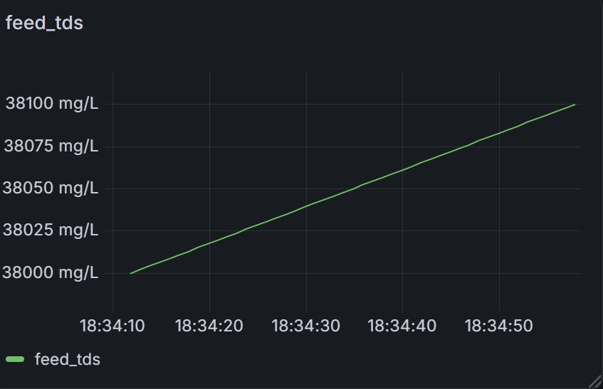


Feed salinity influences the pressure and energy requirements of the desalination process, while RO recovery shows the percentage of incoming feed converted into permeate water.

### Operating Pressure and RO Brine

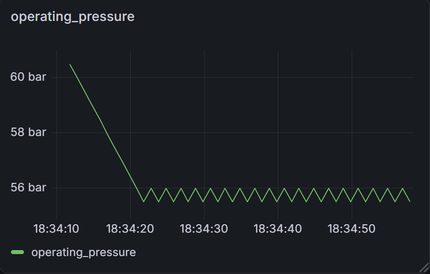

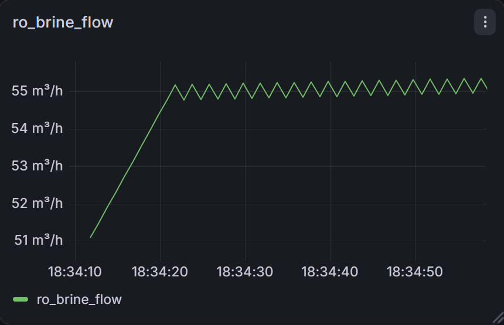

Operating pressure adapts to plant conditions, while RO brine flow represents the concentrated reject stream leaving the RO stage.

### Brine Concentration and Overall Water Recovery

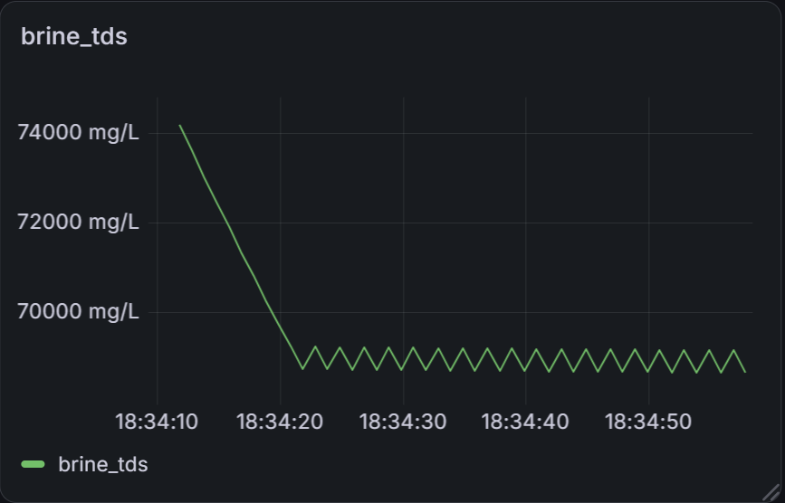

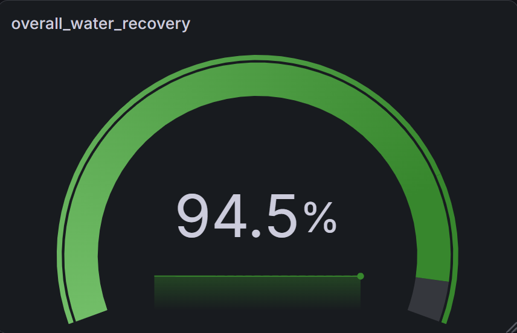

Brine TDS tracks salt concentration in the RO reject stream. Overall water recovery includes water recovered across the integrated RO and ZLD system.

### Energy Performance


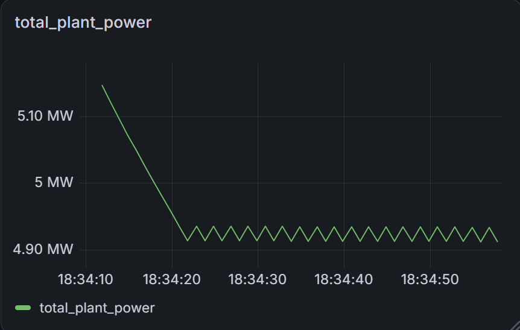

Net power represents RO power demand after PX energy recovery, while total plant power includes the additional ZLD energy requirement.

### Pressure Exchanger Performance


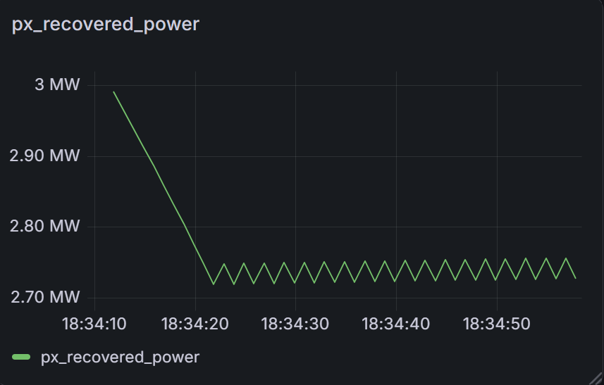

The PX metrics demonstrate the effect of pressure-energy recovery on plant efficiency.

### Equipment Health


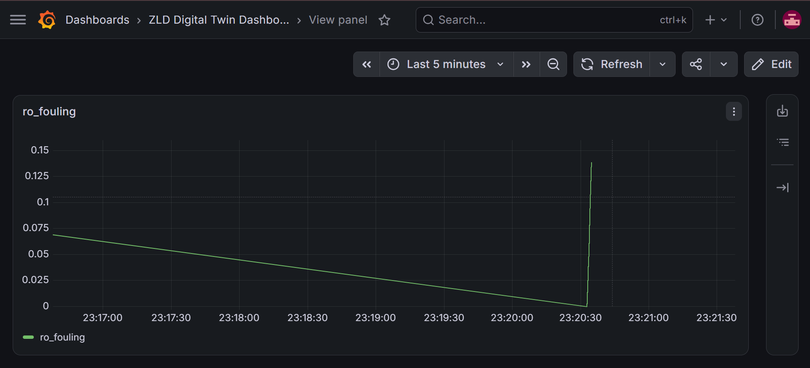

Pump wear and membrane fouling evolve over simulation time and influence long-term plant performance.

### ZLD Performance

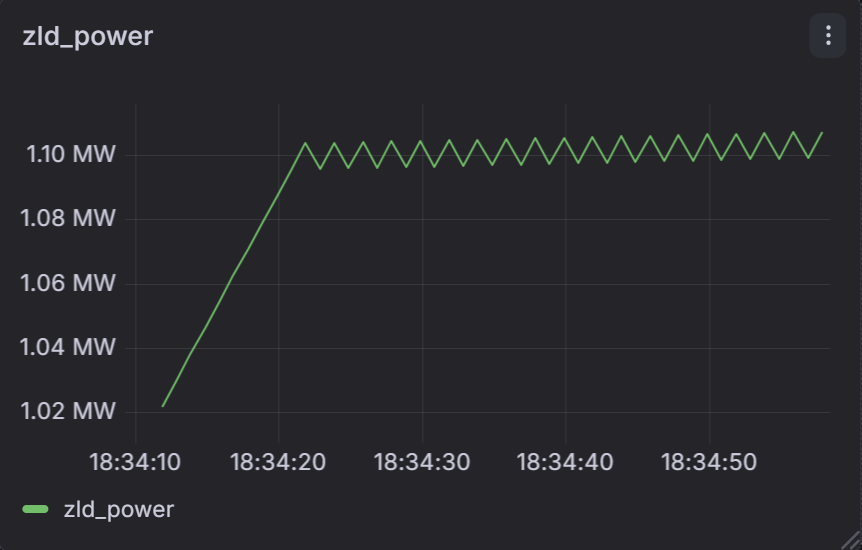

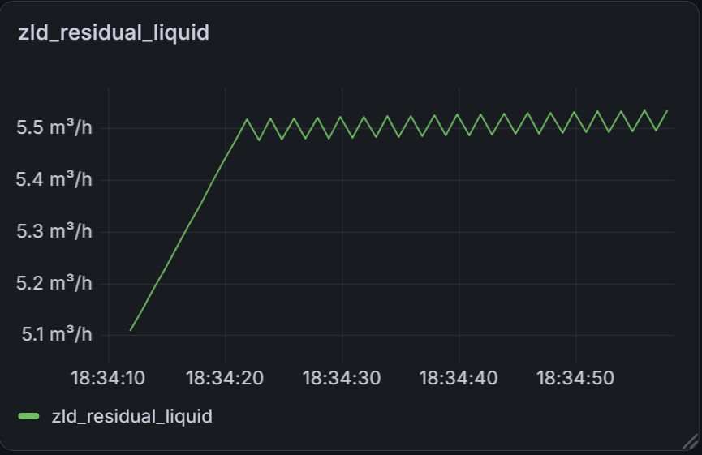

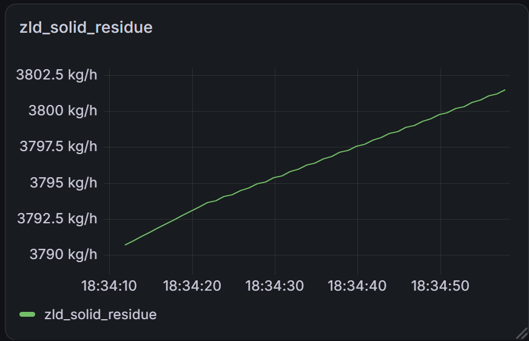

These metrics represent the estimated energy requirement and residual outputs associated with downstream ZLD treatment.

---

## Simulation Scenarios

The Digital Twin supports multiple YAML-configured operating scenarios.

### Baseline

Represents normal plant operation under standard feed and equipment conditions.

### High TDS

Simulates elevated feed salinity and its effect on:

- Required pressure
- RO performance
- Brine concentration
- Energy consumption

### PX Failure

Simulates degraded Pressure Exchanger operation to demonstrate its effect on:

- Energy recovery
- Net RO power
- Plant energy consumption
- Operating economics

### Aged Assets

Represents degraded equipment conditions including reduced efficiency and increased equipment wear.

These scenarios allow the same Digital Twin architecture to evaluate different plant operating conditions without changing the core simulation code.

---

## Repository Structure

```text
zld-digital-twin/
│
├── docs/
│   ├── images/
│   ├── assumptions.md
│   ├── engineering_specification.md
│   └── equations.md
│
├── twin/
│   ├── assets/
│   │   ├── base_asset.py
│   │   ├── pump.py
│   │   ├── ro.py
│   │   ├── px.py
│   │   └── zld.py
│   │
│   ├── configs/
│   ├── kernel/
│   ├── scenarios/
│   ├── state/
│   ├── storage/
│   └── validation/
│
├── run.py
├── requirements.txt
└── README.md
```

---

## Telemetry and Visualization

The simulation generates telemetry for process, asset-health, energy, water, and economic variables.

```text
Python Simulation
       │
       ▼
   Plant State
       │
       ▼
 InfluxDB Writer
       │
       ▼
    InfluxDB
       │
       ▼
     Grafana
```

InfluxDB stores time-series telemetry generated during simulation runs.

Grafana queries this telemetry and provides visual monitoring of the simulated plant.

---

## Technologies

- Python
- InfluxDB
- Grafana
- YAML
- Object-Oriented Programming
- Time-Series Telemetry
- Modular Simulation Architecture

---

## Installation

Clone the repository:

```bash
git clone https://github.com/sanchit020/zld-digital-twin.git
cd zld-digital-twin
```

Install dependencies:

```bash
pip install -r requirements.txt
```

Run the baseline simulation:

```bash
python run.py --scenario baseline
```

A custom number of simulation ticks can also be specified:

```bash
python run.py --scenario baseline --ticks 1000
```

Other scenarios can be executed using:

```bash
python run.py --scenario high_tds --ticks 1000
python run.py --scenario px_failure --ticks 1000
python run.py --scenario aged_assets --ticks 1000
```

---

## InfluxDB and Grafana

InfluxDB telemetry is enabled when the required InfluxDB configuration is available in the environment.

The simulation should use environment variables for sensitive configuration such as authentication tokens.

Do not store InfluxDB tokens or credentials directly in source code or commit them to Git.

When telemetry is enabled:

```text
Simulation → InfluxDB → Grafana Dashboard
```

This allows simulation results to be inspected as time-series plant telemetry.

---

## Model Scope

This project is an engineering-oriented Digital Twin prototype rather than a high-fidelity commercial process simulator.

The models use simplified physics-inspired relationships to demonstrate:

- Dynamic plant-state evolution
- Interaction between RO, pump, PX, and ZLD components
- Equipment degradation
- Energy recovery
- Brine generation and concentration
- Water recovery
- Energy and economic behavior
- Scenario-based simulation
- Real-time telemetry visualization

Detailed chemical kinetics, membrane transport modeling, crystallizer thermodynamics, and plant-scale hydraulic networks are outside the current scope.

---

## Future Improvements

Potential extensions include:

- Predictive maintenance models
- Automated anomaly detection
- Control-system integration
- MQTT or OPC UA connectivity
- Historical telemetry playback
- Additional plant operating scenarios
- Cloud deployment
- Optimization of operating pressure and energy consumption

---

