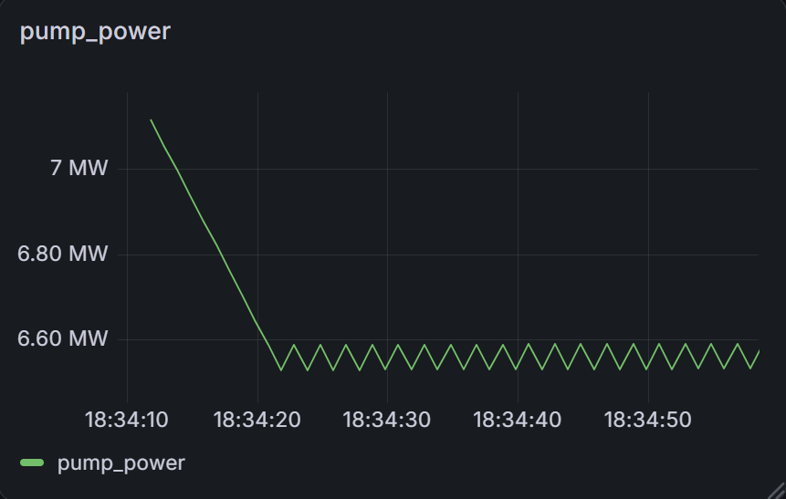
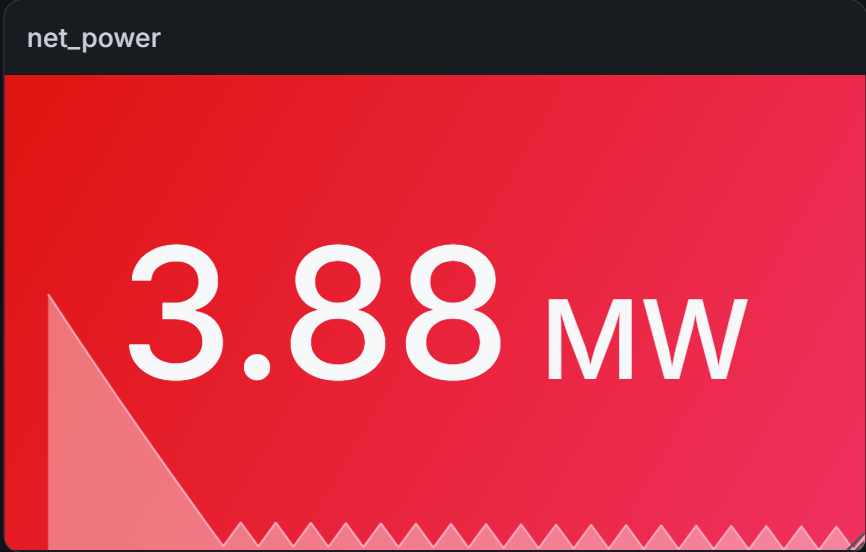
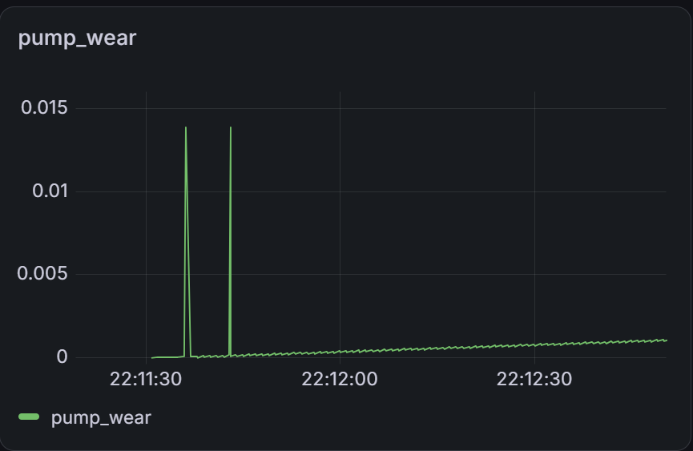
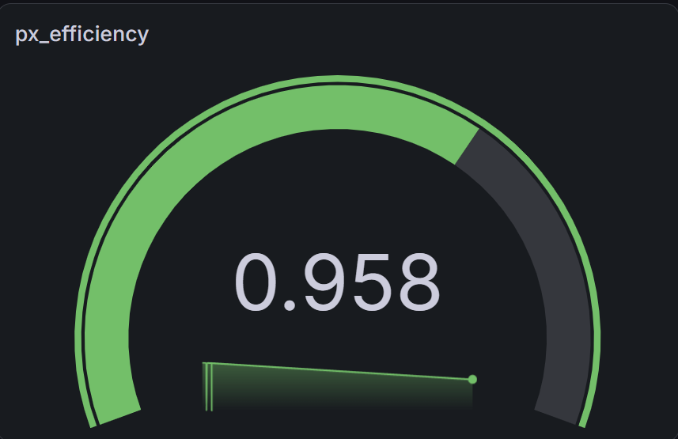
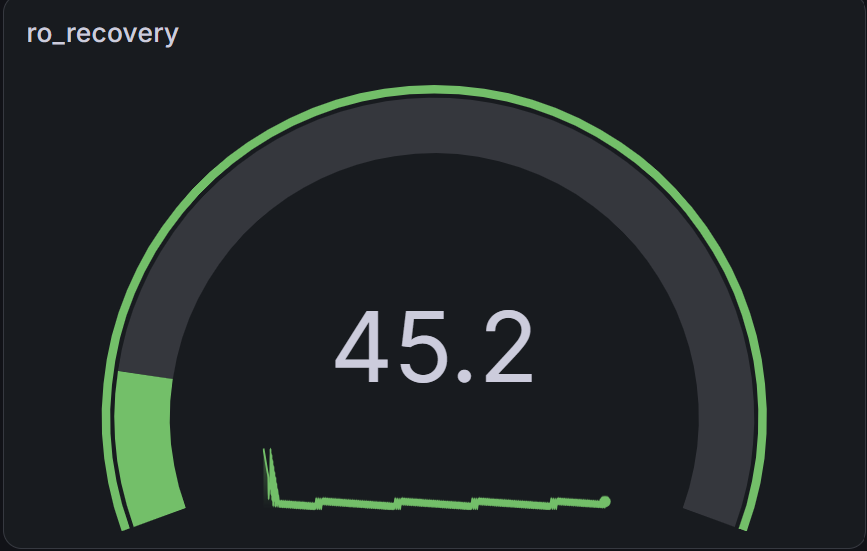
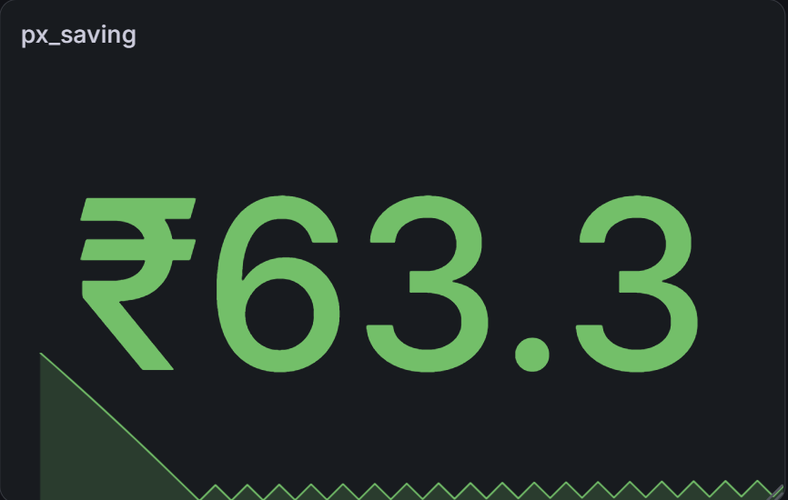
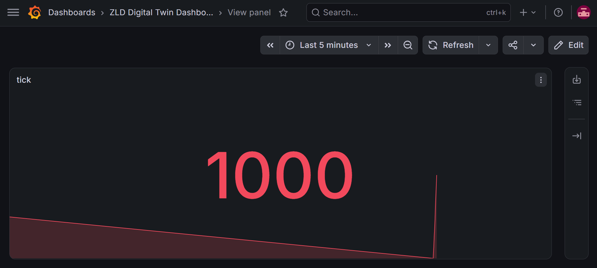
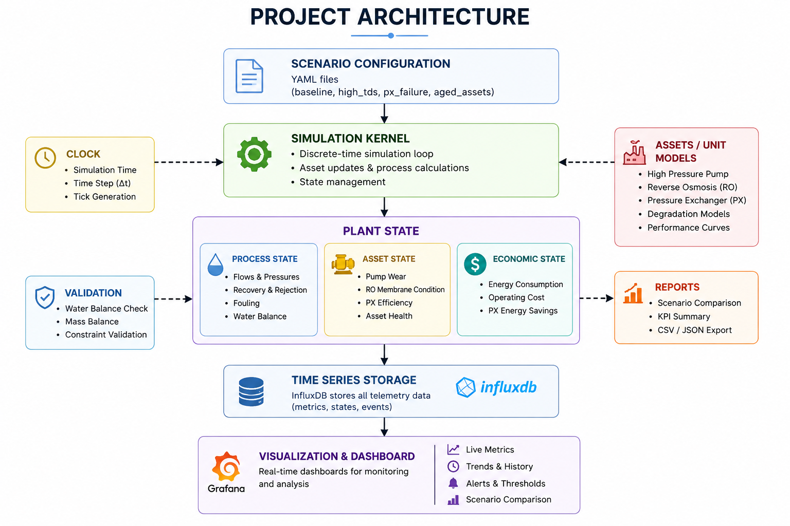

# Zero Liquid Discharge Digital Twin

A modular Digital Twin for a Zero Liquid Discharge (ZLD) Reverse Osmosis plant developed in Python. The project simulates plant operation, equipment degradation, energy consumption, and operating costs while streaming telemetry into InfluxDB for real-time visualization with Grafana.

---

## Dashboard










---

## Overview

This project models a simplified industrial Zero Liquid Discharge (ZLD) plant.

The simulation continuously updates:

* Pump operation
* Reverse Osmosis recovery
* Membrane fouling
* Pressure Exchanger efficiency
* Energy consumption
* Operating cost

Telemetry is stored in InfluxDB and visualized through Grafana.

---

## Features

* Physics-inspired process simulation
* Reverse Osmosis model
* High-pressure pump model
* Pressure Exchanger model
* Pump wear simulation
* Membrane fouling simulation
* Water balance validation
* Energy consumption tracking
* Operating cost calculation
* YAML-based scenario configuration
* Real-time InfluxDB integration
* Grafana dashboard
* Scenario comparison reports

---

## Project Architecture



```
Scenario Configuration
          │
          ▼
   Simulation Kernel
          │
          ▼
      Plant State
 ┌────────┼────────┐
 ▼        ▼        ▼
Process  Assets  Economics
          │
          ▼
      InfluxDB
          │
          ▼
      Grafana
```

---

## Repository Structure

```text
zld-digital-twin
│
├── docs
├── tests
├── twin
│   ├── assets
│   ├── configs
│   ├── kernel
│   ├── reports
│   ├── scenarios
│   ├── state
│   ├── storage
│   └── validation
│
├── run.py
├── requirements.txt
└── README.md
```

---

## Simulation Scenarios

Current scenarios:

* Baseline
* High TDS
* PX Failure
* Aged Assets

Each scenario is configured using YAML.

---

## Dashboard Metrics

The Grafana dashboard displays:

* Pump Power
* Net Power
* Pump Wear
* RO Recovery
* RO Fouling
* PX Efficiency
* PX Savings
* Simulation Tick

---

## Technologies

* Python
* InfluxDB
* Grafana
* YAML
* Object-Oriented Design

---

## Installation

```bash
git clone https://github.com/sanchit020/zld-digital-twin.git

cd zld-digital-twin

pip install -r requirements.txt

python run.py
```

---

## Future Improvements

* Additional process units
* Alarm generation
* MQTT / OPC UA integration
* Cloud deployment
* Historical playback
* More plant operating scenarios

---

## License

MIT License
